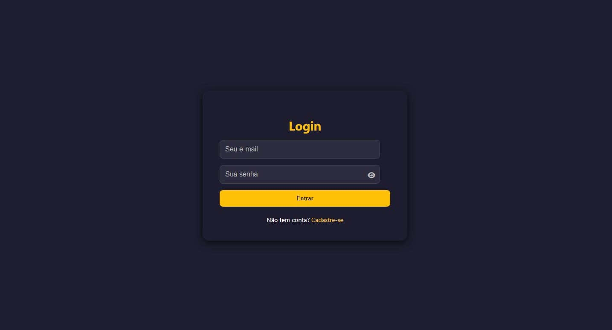
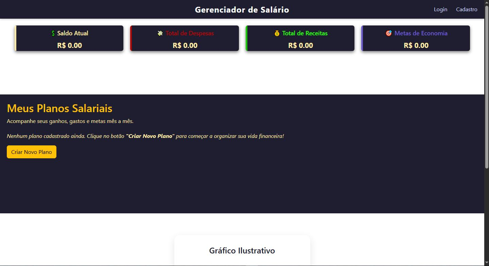
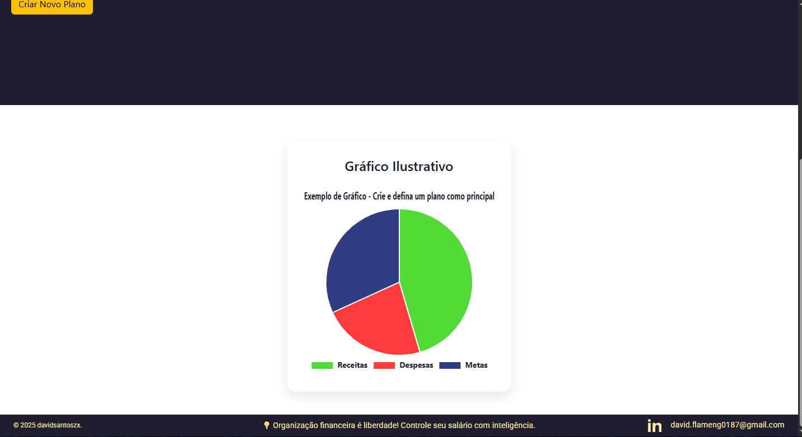
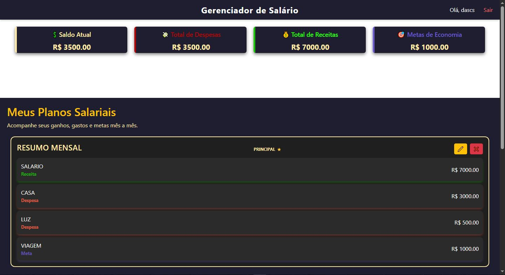
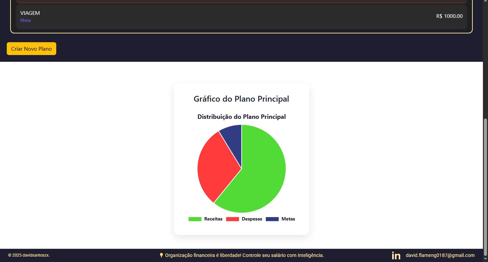
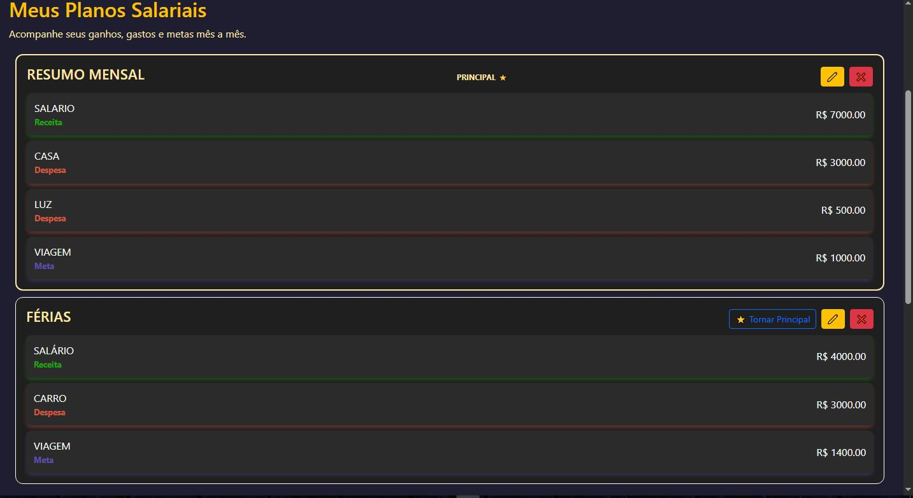
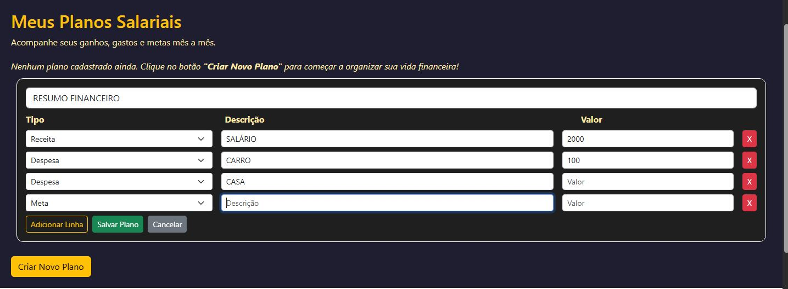

# 💼 Gerenciador de Salário

Este é um projeto simples e funcional de **gerenciador de salário**, desenvolvido com foco em organização financeira pessoal com Flask, React e SQLAlchemy.. O sistema permite criar planos salariais personalizados com receitas, despesas e metas, exibir gráficos, e visualizar informações de maneira clara e prática.

---

## 📷 Imagens do Projeto

### 🔐 Telas de autenticação:
- Cadastro  
  
- Login  
  

### 🏠 Visão geral:
- Página inicial não logada  
    
  

### ✅ Painel do usuário logado:
- Página principal após login  
  
- Gráfico do plano principal  
  
- Painel de planos salariais  
  
- Painel de criação de planos  
  

---

## ⚙️ Funcionalidades

- Cadastro e login de usuários.
- Criação de planos salariais com receitas, despesas e metas.
- Definição de plano principal.
- Sincronização de dados com os cards principais.
- Visualização de gráfico em pizza dos dados do plano.
- Interface responsiva com painel e navegação clara.

---

## 🚀 Como executar localmente

> Pré-requisitos: Python 3.10+, pip, Git

1. Clone este repositório:

```bash
git clone https://github.com/davidsantoszx/gerenciadorsalario.git
cd gerenciadorsalario
